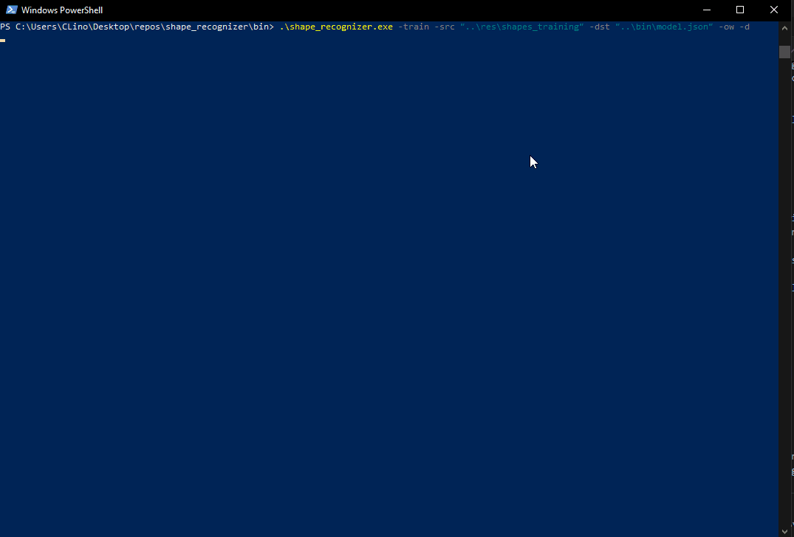

# Shape Recognizer

## Description

Finds geometrical shapes on input images, by cross-referencing with trained model data. 

Has the potential to be expanded to other applications, not just geometrical shapes.

Python project, combining OpenCV and classical deterministic computer vision approaches.

The main euristic of the algorithm is to create a table of scores of the how polygon representations of the input shapes and the shapes used for training match.

Robust against scale and rotation variations.

There's room from improvement on the implementation, but the algorithm seemed good enough to showcase.

## Table of Contents
- [Examples](#examples)
- [Usage](#usage)
- [Compilation](#compilation)
- [Help Commands](#help-commands)
- [License](#license)
- [Author](#author)

## Examples

Example finding geometric shapes:


Example finding a user drawn shapes:


Example training a model:


## Usage

Running the following command on the powershell will:
```console
.\shape_recognizer.exe -eval -src "..\res\shapes_samples" -model ".\model.json" -cls 0.85 -dst ".\output.csv" -ow -d
```
- read all the images inside the path specified after '-src'
- save the classification results on the path specified after '-dst': "output.csv"
- the flag '-cls' will write the classification of the shapes, without the match score ambiguity, to the output file; it will only consider a classification to be true, if the shape match score is superior to the 0.85 threshold.
- the flag -ow will allow overwriting the output file if it already exists
- the flag '-d' will show the results on interactive plot windows just before the output file is written

Running the following command on the powershell will:
```console
.\shape_recognizer.exe -eval -usr -model ".\model.json" -dst ".\output.csv" -ow -d
```
- create a plot area where the user my draw an image to be searched for shapes. On the drawing area, the user may draw with the LMB and erase wiht the RMB. Pressing 'c' will clear the canvas and 'a' will accept the drawing and proceed with the algorithm
- save the classification match score results on the path specified after '-dst': "output.csv"
- the flag -ow will allow overwriting the output file if it already exists
- the flag '-d' will show the results on interactive plot windows just before the output file is written


Running the following command on the powershell will:
```console
.\shape_recognizer.exe -train -src "..\res\shapes_training" -dst "..\bin\model.json" -ow -d
```
- read all the training images inside all the directories at the directory level defined by the path specified after '-src'
- save the training results to the path specified after -dst, to a file named "model.json"
- the flag -ow will allow overwriting the destination file if it already exists
- the flag '-d' will show the discriptors found on each of the input images (warning: if many input images are used, this option may create many sub-windows, and should only be used when debugging)

## Compilation

I'd recommend using the pre-built executable inside \bin: **shape_recognizer.exe**. 

To build the code, use the following command at the \src level:

```console
py -m PyInstaller --onefile --icon=../res/icons/app_icon.ico --distpath ../bin --workpath ../build --specpath ../build --name shape_recognizer main.py
```

**Note:** some Python packages may have to be installed for the compilation to be successful.

## Help Commands

Option flags for **shape_recognizer.exe**:

- Use '-train' to set the mode to train a classification model.
- Use '-eval' to set the mode to classify a group of images based on a previously trained model.
- Use '-src' when training followed by a folder containing images to be used for training the model, or, when evaluating, followed by an image or a folder containing images to be classified.
- Use '-model' when evaluating followed by the path to a previously trained model file.
- Use '-dst' followed by the path to the destination model '.pth' file when training, or, when evaluating, followed by the path to the classification '.csv' file.
- Use '-usr' when evaluating to open a drawing area, where the user may draw an input image. This option will prevail over '-src'. On the drawing area use: LMB to draw, RMB to erase, 'c' to clear the canvas and 'a' to accept the image and proceed.
- Use '-h' for help.
- Add '-ow' to overwrite the file specified after '-dst', if it already exists.
- Add '-d' to diagnose what the algorithms are doing under the hood.
- Add '-cls' when evaluating, followed by a threshold between 0-1, to write the best classification instead of match scores to the output file.

## License

MIT License. Use the code however you please, it's free!

## Author

Pedro Lino