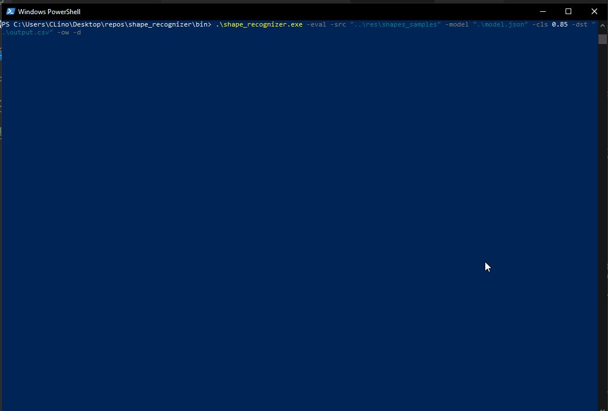
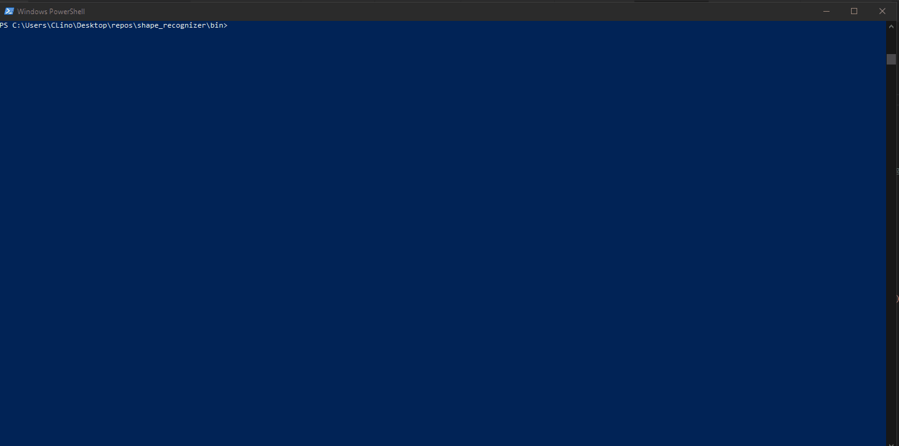

# Shape Recognizer

## Description

Finds geometrical shapes on input images, by using the trained model data.

The algorithm uses classical deterministic approaches and OpenCV to get the job done, so, no neural networks were used.

The main euristic is to use the relation between the contour edges of the shapes to create descriptors and posteriorly compare them.

Robust against variations on scale and rotation (up to +-90º from teh training).

There's of course room from improvement of the algorithm, but it's good enough to showcase.

## Table of Contents
- [Examples](#examples)
- [Usage](#usage)
- [Compilation](#compilation)
- [Help Commands](#help-commands)
- [License](#license)
- [Author](#author)

## Examples

Example finding a user drawn shapes:

Example finding geometric shapes:

## Usage

Running: '.\shape_recognizer.exe python -src "..\res\shapes_samples" -model "..\bin\model.json" -dst "..\bin\output.csv" -ow -v' on the PowerShell will:
- read all the images inside the path specified after '-src'.
- save the result scores on the '-dst' specified path "output.csv", the flag -ow will allow overwriting the file if it already exists.
- the flag '-v' will show the results on interactive plot windows just before the output file is written.

Running: '.\shape_recognizer.exe -usr -model "..\bin\model.json" -dst "..\bin\output.csv" -ow -v' on the PowerShell will:
- create a plot area where the user my draw an image to be searched for known shapes. The user may press 'c' to clear the canvas and 'a' to accept the drawing and proceed with the algorithm.
- save the result scores on the '-dst' specified path "output.csv", the flag -ow will allow overwriting the file if it already exists.
- the flag '-v' will show the results on interactive plot windows just before the output file is written.

Running: '.\train_shapes.exe -train -src "..\res\shapes_training" -dst "..\bin\model.json" -ow' on the PowerShell will:
- read all the training images inside all the directories at the path level specified after '-src'
- save the training results to the path specified after -dst, to a file named "model.json", the flag -ow will allow overwriting the file if it already exists.

## Compilation

I'd recommend using the pre-compiled executable inside \bin: **shape_recognizer.exe**. 

To compile the code yourself directly from the repository directory, you may run on a PowerShell at the \src level:

py -m PyInstaller --onefile --icon=../res/icons/app_icon.ico --distpath ../bin --workpath ../build --specpath ../build --name shape_recognizer main.py

**Note:** some python packages may have to be installed for the compilation to be successful.

## Help Commands

Option flags for **shape_recognizer.exe**:

- Use '-train' to run the executable for training.
- Use '-solve' to run th executable for finding shapes.
- Use '-src' followed by a path to an image or a folder containing images to be used for training or for solving.
- Use '-model' when solving followed by the path to a previously trained model file.
- Use '-dst' followed by the path to the destination destination .csv file.
- Use '-usr' when solving to draw an image to be searched for trained shapes (while drawing, use 'c' to clear and 'a' to accept).
- Use '-h' for help.
- Add '-ow' to overwrite the previous file specified as -dst if it already exists.
- Add '-v' when solving to show the shape finding results.
- Add '-d' to debug the shapes being trained.
- Add '-s' to specify the shape search sensitivity, it's default value is 0.01 and is truncated between 0 and 0.1.

## License

MIT License. Use the code however you please, it's free!

## Author

Pedro Lino